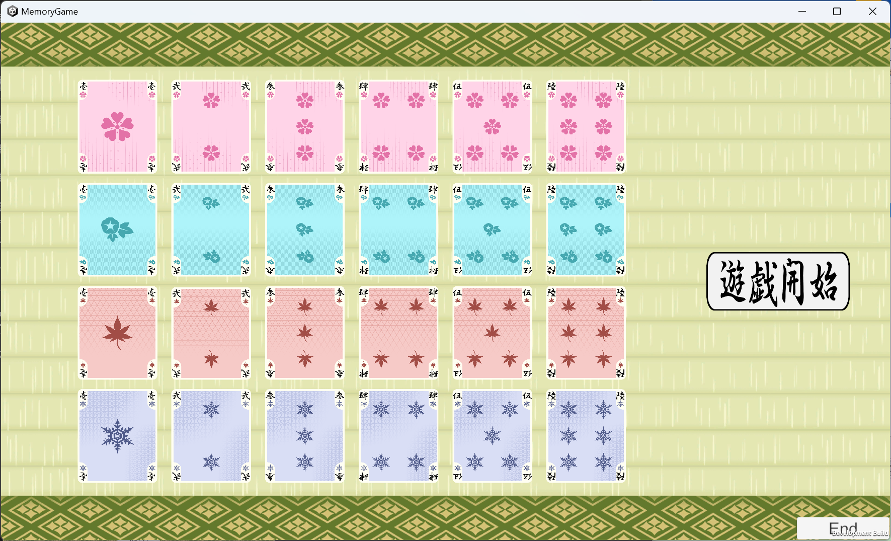
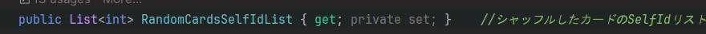

# MemoryGame

## ゲーム実行ファイルとソースコードのダウンロード

**実行ファイルのダウンロード**<a href="https://drive.google.com/file/d/1bd4K1d2SzweLjQI23cq4S9Yrir-7wlsW/view?usp=drive_link" target="_blank">ここをクリック</a>

**ソースコードのダウンロード**<a href="https://github.com/Shatang0821/MemoryGame/archive/refs/heads/main.zip" target="_blank">ここをクリック</a>

## 概要

**制作環境** : Unity2022.3.8f1

**制作人数** : 個人制作

**制作期間** : 2024.3.23~2024.4.15

**説明** : 学校のゲームジャムで制作したシールを貼るタイプの神経衰弱ゲームに触発され、その後個人でオンライン対戦できる神経衰弱を作ることを目指した。この新たな挑戦では、PUN2（Photon Unity Networking 2）を使用してリアルタイム通信を実装し、プレイヤー間のインタラクティブなオンライン体験を提供することを目標としました。

(今回作成したゲームの素材もゲームジャムの時のデザイナーが作成した素材をそのまま使いました)

---

## ゲーム画面

**プレイ画面**

  
  
  
  

## 技術紹介
#### 目次
- [UIフレームワーク](#UIフレームワーク)
- [MVCパターン](#キャラクター)
- [データ構造](#ステージ)
- [オブザーバーパターン](#オブジェクトプール)

---

### UIフレームワーク

Editor拡張して

対象UIオブジェクトを選んでファイルの自動生成ができます

UIマネージャーがUIの動的生成を制御し、チーム制作の時に複数人が一つのシーンを操作することを防ぐことができます

<a href = "https://github.com/Shatang0821/MemoryGame/blob/main/Assets/_Scripts/FrameWork/Managers/UIManager.cs" target="_blank" rel="noopener noreferrer">UIManagerコード</a>

UICtrl基底クラスでUIオブジェクトを操作するクラスの基本機能を用意し、スクリプト内で子UIオブジェクトの操作ができるため、プレハブの調整による衝突の可能性を下がります。

<a href = "https://github.com/Shatang0821/MemoryGame/blob/main/Assets/_Scripts/FrameWork/Utils/UICtrl.cs" target="_blank" rel="noopener noreferrer">UICtrlコード</a>

---

### MVCパターン
モデル：  

    
    card: カード自体の情報
    Deck : カードの順番管理、シャッフル機能があります
    GameBoard : Deckの順番に沿ってカードを盤面に配る機能、プレイヤーの入力座標からカード情報の取得機能

ビュー：

     CardView : カードの見た目情報と実際のプレハブを管理するクラス、カードの移動、回転アニメーションの制御

コントローラ：

    GameController : ゲームの盤面、デッキ、プレイヤーを管理するクラス、プレイヤーの入力に応じてモデルとビューに知らせるための機能を持っています

このようにそれぞれの役割を明確にし、コードの見やすいようにして、さらにデータとUIを分離して保守性が高まります。

<a href = "https://github.com/Shatang0821/MemoryGame/tree/main/Assets/_Scripts/Game/Card" target="_blank" rel="noopener noreferrer">モデルとビューのコード</a>

<a href = "https://github.com/Shatang0821/MemoryGame/blob/main/Assets/_Scripts/Game/Manager/GameController.cs" target="_blank" rel="noopener noreferrer">コントローラーのコード</a>

---

### データ構造

カードはゲーム上のUIとスクリプト内のデータに分かれて、実際に表示しているカードはImage以外アタッチしていないことでパフォーマンスを向上させる。

カードは盤面クラスの2次元配列に保存されて

クリック位置の座標を使ってカードを識別する。

盤面のカード順番を保持するDeckクラスのint型配列を使って少ないデータ量で同期することができた

---

### オブザーバーパターン

イベントセンタークラスでイベントの集中管理をしイベントのトリガーを同期させることによって各プラットフォームが同じイベントを呼び出すことができる

また、イベントの登録を各クラスで行い、クラス間の結合度を下げることができます!

<a href = "https://github.com/Shatang0821/MemoryGame/tree/main/Assets/_Scripts/FrameWork/EventCenter" target="_blank" rel="noopener noreferrer">詳細コード</a>

---